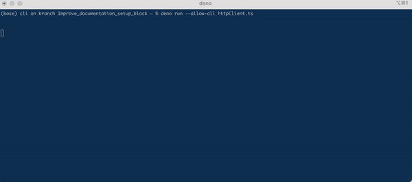

# Sapial
Semi-Autonomous Personal Intelligent Agent from Large language models

Sapial is a open framework for building personal agents that can be trained on your own data. It is built on top of [Deno](https://deno.land/), [Transforemrs](), [Langchain](), and [llama-index]().

Why **Deno**? 

**Deno** is a secure, user-friendly runtime for JavaScript, TypeScript, and WebAssembly, built on V8, Rust, and Tokio. It supports TypeScript natively, provides built-in development tools, and accommodates existing npm modules. Distributed as a single executable, Deno doubles as both a runtime and package manager, using browser-compatible protocols for loading modules. It's an ideal environment for modern programming and a great alternative for utility scripts previously written in Bash or Python.

## Architecture
Sapial is broadly divided into three parts:
1. **Python backend services**, exposed over local FastAPI bridge
2. **Deno runtime (middleware)**, for running the agent
3. **Client Interfaces**, that connect to the Deno runtime via local HTTP API


## Table of contents

- [Setup Sapial](#setup)
- [Start building Sapial](#installation)
- [Contributors guide](#contribution-guide)

## Setup
1. ### Install [Deno](https://deno.com/runtime)

    To check if you already have it installed, run 
    ```bash
    deno --version
    ```

    If Deno is installed, you should see a message like `deno 1.x.x` where `x.x` represents a version of deno

    If you get `command not found` proceed with installation according to your OS
    <details>
    <summary>MacOS and Linux</summary>

    Using Shell
    ```bash
    curl -fsSL https://deno.land/x/install/install.sh | sh
    ```

    or using [Homebrew](https://formulae.brew.sh/formula/deno)
    ```bash
    brew install deno
    ```
    </details>

    <details>
    <summary>Windows</summary>

    Using [Scoop](https://scoop.sh/)

    ```bash
    scoop install deno
    ```


    or using [Chocolatey](https://chocolatey.org/packages/deno)
    ```bash
    choco install deno 
    ```
    </details>

2. ### Install [Python](https://www.python.org/) and [Pip](https://pip.pypa.io/en/stable/installation/)
    To check if you already have it installed, run 
    ```bash
    python --version
    ``` 

    If Python is installed, you should see a message like `python 2.x.x` where `x.x` represents a version of Python

    If you get `command not found` proceed with installation according to your OS

    <details>
    <summary>MacOS and Linux</summary>
    </br>

    Directly through [python](https://www.python.org/downloads/) website

    or, using [Homebrew](https://formulae.brew.sh/)
    ```bash
    brew install python
    ```

    </details>

    <details>
    <summary>Windows</summary>
    </br>

    Directly through [python](https://www.python.org/downloads/) website

    or, using [Scoop](https://scoop.sh/)

    ```bash
    scoop install main/python
    ```

    or, using [Chocolatey](https://chocolatey.org)
    ```bash
    choco install python --pre 
    ```
    </details>


    ### Important! ###
    **In case you didn't have Python installed, make sure to restart your computer before proceeding to the next steps!**

    Usually Pip is automatically installed with python

    To check if you already have it installed, run 
    ```bash
    pip --version
    ``` 

    If you get `command not found` proceed with installation according to your OS

    <details>
    <summary>MacOS and Linux</summary>
    </br>

    Using cli 
    ```bash
    python -m ensurepip --upgrade
    ```

    </details>

    <details>
    <summary>Windows</summary>
    </br>


    Using cli 

    ```bash
    C:> py -m ensurepip --upgrade
    ```

    </details>

4. ### Setup a Python [Virtual Environment](https://www.freecodecamp.org/news/how-to-setup-virtual-environments-in-python/) 

    To setup the virtual environment, run this command in the terminal
    ```pip install virtualenv```

    To use venv in your project, change directory into `services` by running
    `cd services`

    nd then run `python -m venv venv`

    This will create a vurtual environment inside `services` folder named `venv`

    run `cd ..` in your terminal to get back to the root folder


5. ### Install Python Dependencies 

    To install, run `pip install -r ./services/requirements.txt` in your terminal

6. ### Setup your local environmental variables

    In the root of directory, create a new file named `.env`

    Open `.env` file using editor of your choice and add your OpenAI API key

    Your `.env` file should look like this 
    ```bash 
    OPENAI_API_KEY = "your_API_KEY" 
    ```


## Installation 

### Starting an agent 

To start an agent, run the following command in your terminal
```bash 
deno run --allow-all --unstable ./agents/alice.ts
```

In a separate terminal, start the CLI client by running

```bash
cd /clients/cli
deno run --allow-all httpClient.ts
```

To check if everything is working properly, type any prompt in the latter terminal




## Contribution guide ##
We **appreciate** and **highly encourage** community contributions!

1. ### Fork the repository (repo)
    If you're not sure, here's how to [fork the repo](https://help.github.com/en/articles/fork-a-repo).

2. ### Clone your fork 
    To clone your repo, you can run the command in the terminal of your choice
    ```bash
    git clone git@github.com:[your_github_handle]/sapial.git && cd sapial
    ```
3. ### Make, commit and push changes
    Create new branch and make changes
    ```bash
    git checkout -b new_branch_name
    ```

    Make changes where necessary and save them by running

    ```bash
    git add --all
    git commit -m "Use a message that best describes changes"
    ```

    Push the changes to your repo
    ```bash
    git push
    ```

4. ### Propose changes by opening a PR
    After your changes are committed to your GitHub fork, submit a pull request (PR) to the `main` branch of the `sapial-ai/sapial` repo
## Debug ##
Kill the fastAPI server on agent crash
lsof -i :8000 -> <PID>
kill -9 <PID>

## Next Steps Implementation
- add formatting to text
- start implementing basic agent architectures 
- add a retriever using llama-index
- tools and plugins

# Final Sharing
- share notes and repo with Andrew 

## Next Steps Planning
 - define personas
 - define personal alignment stratgies

## Later
- Refactor http server to be a class
- Add authentication for agents and clients using LibP2P
